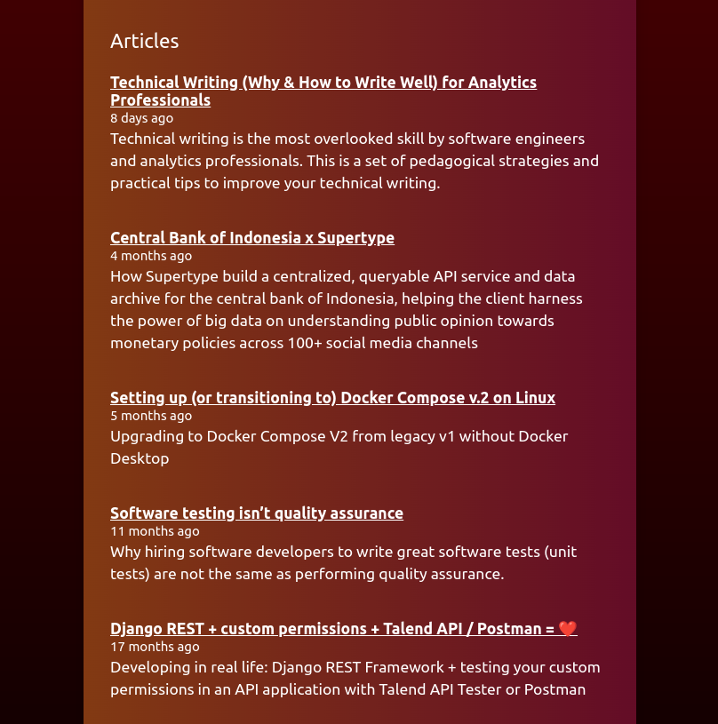

[](https://supertype.ai)

## WordPress-Posts-React

A lightweight (<10 kb!) set of React hooks and components to asynchronously fetch and display WordPress posts using WordPress's most updated [REST API](https://developer.wordpress.org/rest-api/). 

### Why? 
Almost all of the other WordPress React libraries I found were either too bloated or too old and unmaintained, which uses outdated mechanisms to retrieve blog articles off WordPress sites. This library is designed to be as lightweight as possible (no dependencies), and provides drop-in components to display posts in a variety of ways directly in your React app.

## Installation
You can install the package using `yarn` or `npm`:
```bash
yarn add wordpress-posts-react
# or
npm install wordpress-posts-react
```
This will install `wordpress-posts-react` from [on the npm registry](https://www.npmjs.com/package/wordpress-posts-react) and add it to your `package.json` file.

## Usage
### Common Pattern
The most common pattern is to use the `useWordPressFeed` hook to fetch posts from a WordPress site, and then use the `WordPressBlogroll` component to render the posts as a blogroll. The following snippet demonstrates that:

```js
import { WordPressBlogroll, useWordPressFeed } from 'wordpress-posts-react'

const Blogroll = () => {

    const { feed, loading } = useWordPressFeed('https://supertype.ai')

    if(!loading){
    return (
        <main>
            <div>
                <h1>{feed.length} Articles</h1>
                <WordPressBlogroll feed={feed} />
            </div>
        </main>
    )}
    else{
        return <div>Loading...</div>
    }
}
```

This will fetch the latest 10 posts from the WordPress site at `https://supertype.ai` and render a beautifully formatted blogroll in your React or Next.js app. 

It uses WordPress' [officially documented](https://developer.wordpress.org/rest-api/) REST API to fetch the posts, so it will always be up to date with the latest WordPress features, returns JSON data (yay! no XML!), ⚡ fast, and with almost no 🚧 maintenance required. Weighing at less than 10kb, it's also 🪶 featherweight, with no dependencies.

- 🎁 Beautifully formatted blogroll
- 📅 Human-friendly dates (e.g. "2 days ago")
- 💨 Uses `async` and `await` to fetch posts asynchronously
- 🚀 Uses WordPress's official REST API to fetch posts
- 📦 No dependencies (Less than 10kb in size)




### Hooks and Components

`useWordPressFeed(site_url, author_id, number_of_posts = 10)` is a React hook that asynchronously fetches posts from a WordPress site and returns the posts as an array of objects. Only its first argument is required: the URL of the WordPress site you want to fetch posts from.

- `author_id`: If specified, this narrows down to WordPress posts of the author you want to fetch posts from. If you don't pass in an `author_id`, it will fetch posts from all authors.
- `number_of_posts`: The number of posts you want to fetch. Defaults to 10.

💡 Pro tip: To confirm that the site is in fact a WordPress site, you can append `/wp-json` to your site (e.g `<your-site>/wp-json/`) and see if it returns a JSON object. If it does, then you can be sure that the site is a WordPress site. This is the same mechanism that `wordpress-posts-react` uses to fetch and render the Wordpress posts as an isolated React component.


```js
import { useWordPressFeed } from 'wordpress-posts-react'

// fetches author id=23's latest 10 posts from https://supertype.ai
useWordPressFeed('https://supertype.ai', 23)

// fetches author id=17's latest 5 posts from https://supertype.ai
useWordPressFeed('https://supertype.ai', 17, 5)
```

`WordPressBlogroll({ feed })` is a React component that renders a blogroll of posts. It takes in a `feed` prop, which is an array of objects that contain the post's title, date, excerpt, and link. Usually used in conjunction with `useWordPressFeed` to fetch posts from a WordPress site.

```js
import { useWordPressFeed, WordPressBlogroll } from 'wordpress-posts-react'

const { feed, loading } = useWordPressFeed('https://supertype.ai')
{
    !loading &&
        <WordPressBlogroll feed={feed} />
}
```

### Development 
This package uses Rollup to bundle the library. To build it, run with either:

```bash
yarn build
# or
npm run build
```

To do this in watch mode, run:
```bash
yarn start
# or
npm run start
```
